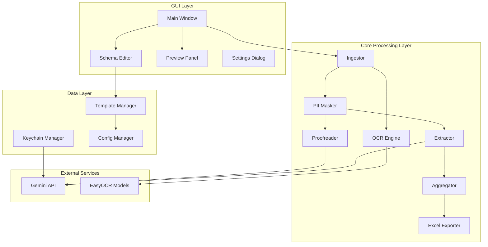

# Design Document

## Overview

The Automated Report Extraction System is a Windows desktop application built with PySide6 that processes multiple document formats (PDF, DOCX, Excel) through OCR and AI-powered extraction. The system uses a modular architecture with clear separation between GUI, core processing, and external service integration. The application prioritizes user privacy through local processing options and PII masking when using cloud services.

## Architecture

### High-Level Architecture



### Processing Pipeline

```mermaid
sequenceChart
    participant User
    participant GUI
    participant Ingestor
    participant OCR
    participant Masker
    participant Proofreader
    participant Extractor
    participant Exporter
    participant GeminiAPI
    
    User->>GUI: Import files + Configure schema
    GUI->>Ingestor: Process file list
    Ingestor->>OCR: Extract text (if needed)
    OCR-->>Ingestor: Raw text
    Ingestor->>Masker: Apply PII masking
    Masker-->>Proofreader: Masked text
    Proofreader->>GeminiAPI: Proofread request (optional)
    GeminiAPI-->>Proofreader: Corrected text
    Proofreader-->>Extractor: Clean text
    Extractor->>GeminiAPI: Extraction request
    GeminiAPI-->>Extractor: Structured data
    Extractor-->>Exporter: Aggregated results
    Exporter-->>User: Excel file
```

## Components and Interfaces

### GUI Components

#### MainWindow
- **Purpose**: Primary application interface with drag-drop functionality
- **Key Methods**:
  - `setup_ui()`: Initialize layout and controls
  - `handle_file_drop(files)`: Process dropped files
  - `start_processing()`: Initiate extraction pipeline
  - `update_progress(current, total)`: Update progress indicators
- **Dependencies**: SchemaEditor, PreviewPanel, SettingsDialog

#### SchemaEditor
- **Purpose**: Dynamic schema configuration interface
- **Key Methods**:
  - `add_field(name, type, description)`: Add new extraction field
  - `remove_field(field_id)`: Remove existing field
  - `validate_schema()`: Ensure schema completeness
  - `export_template()`: Save current schema as template
- **Data Structure**: Field objects with name, type, description, optional flag

#### PreviewPanel
- **Purpose**: Display extraction results before export
- **Key Methods**:
  - `show_file_preview(file_path, extracted_data)`: Display per-file results
  - `show_summary_preview(aggregated_data)`: Display summary statistics
  - `highlight_missing_data()`: Mark incomplete extractions

### Core Processing Components

#### Ingestor
- **Purpose**: File format detection and text extraction
- **Key Methods**:
  - `process_pdf(file_path)`: Extract text using PyMuPDF, fallback to OCR
  - `process_docx(file_path)`: Extract text and tables using python-docx
  - `process_excel(file_path)`: Convert tables to natural language text
  - `detect_format(file_path)`: Identify file type and processing method
- **Output**: Standardized text content with metadata

#### OCREngine
- **Purpose**: Optical character recognition for scanned documents
- **Key Methods**:
  - `initialize_reader(languages)`: Setup EasyOCR with Vietnamese/English
  - `extract_from_image(image_path)`: Process single image
  - `extract_from_pdf_page(page)`: Process PDF page as image
- **Configuration**: DPI settings, language models, confidence thresholds

#### PIIMasker
- **Purpose**: Protect sensitive information before cloud processing
- **Key Methods**:
  - `mask_for_cloud(text)`: Apply all masking rules
  - `mask_account_numbers(text)`: Hide financial account numbers
  - `mask_id_numbers(text)`: Hide CMND/CCCD numbers
  - `mask_emails(text)`: Partially hide email addresses
  - `mask_phone_numbers(text)`: Hide middle digits of phone numbers
- **Patterns**: Regex patterns for Vietnamese PII formats

#### Extractor
- **Purpose**: AI-powered data extraction using langextract
- **Key Methods**:
  - `extract_with_schema(text, template)`: Run langextract with dynamic schema
  - `validate_extraction(results, schema)`: Check result completeness
  - `retry_failed_extractions(failed_items)`: Retry with adjusted parameters
- **Integration**: Gemini API through langextract library

### Data Management Components

#### TemplateManager
- **Purpose**: Save/load extraction configurations
- **Key Methods**:
  - `save_template(name, schema, settings)`: Persist template as JSON
  - `load_template(name)`: Restore template configuration
  - `list_templates()`: Get available templates
  - `delete_template(name)`: Remove template file
- **Storage**: `%APPDATA%/LangExtractor/templates/` directory

#### KeychainManager
- **Purpose**: Secure API key storage
- **Key Methods**:
  - `save_api_key(key)`: Store using Windows Credential Manager
  - `load_api_key()`: Retrieve stored key
  - `validate_api_key(key)`: Test key with Gemini API
  - `delete_api_key()`: Remove stored credentials
- **Security**: Windows DPAPI encryption

## Data Models

### Template Schema
```python
@dataclass
class ExtractionField:
    name: str
    type: str  # 'text', 'number', 'date', 'currency'
    description: str
    optional: bool = False
    number_locale: str = 'vi-VN'

@dataclass
class ExtractionTemplate:
    name: str
    prompt_description: str
    fields: List[ExtractionField]
    examples: List[Dict]
    provider: Dict  # API configuration
    run_options: Dict  # langextract parameters
```

### Processing Result
```python
@dataclass
class ExtractionResult:
    source_file: str
    extracted_data: Dict[str, Any]
    confidence_scores: Dict[str, float]
    processing_time: float
    errors: List[str]
    
@dataclass
class ProcessingSession:
    template: ExtractionTemplate
    files: List[str]
    results: List[ExtractionResult]
    summary_stats: Dict
    export_path: str
```

### Configuration
```python
@dataclass
class AppConfig:
    ocr_enabled: bool = True
    ocr_languages: List[str] = field(default_factory=lambda: ['vi', 'en'])
    proofread_enabled: bool = True
    pii_masking_enabled: bool = True
    offline_mode: bool = False
    max_workers: int = 4
    log_level: str = 'INFO'
```

## Error Handling

### Error Categories
1. **File Access Errors**: Permissions, corruption, unsupported formats
2. **OCR Errors**: Model loading, image processing, language detection
3. **API Errors**: Network issues, authentication, rate limits, quota exceeded
4. **Extraction Errors**: Schema validation, data type conversion, missing fields
5. **Export Errors**: File permissions, disk space, Excel formatting

### Error Recovery Strategies
- **Graceful Degradation**: Continue processing remaining files when individual files fail
- **Retry Logic**: Automatic retry for transient API failures with exponential backoff
- **Fallback Options**: OCR fallback for text extraction, offline mode for API failures
- **User Notification**: Clear error messages with suggested actions

### Logging Strategy
- **Structured Logging**: JSON format with timestamp, level, component, message
- **PII Protection**: Mask sensitive content in logs
- **Log Rotation**: Automatic cleanup of old log files
- **Debug Mode**: Detailed logging for troubleshooting

## Testing Strategy

### Unit Testing
- **Component Isolation**: Mock external dependencies (APIs, file system)
- **Data Validation**: Test schema validation, data type conversion
- **Error Scenarios**: Test error handling and recovery mechanisms
- **PII Masking**: Verify masking patterns work correctly

### Integration Testing
- **End-to-End Workflows**: Complete processing pipeline with sample documents
- **API Integration**: Test Gemini API calls with various inputs
- **File Format Support**: Test all supported document formats
- **Template Management**: Test save/load functionality

### Performance Testing
- **Throughput**: Process 200+ documents within acceptable time limits
- **Memory Usage**: Monitor memory consumption during large batch processing
- **Concurrent Processing**: Test multi-threading performance and stability
- **OCR Performance**: Measure OCR accuracy and speed on various document qualities

### User Acceptance Testing
- **Usability**: Test drag-drop interface, schema configuration, preview functionality
- **Accuracy**: Validate extraction accuracy against manually labeled test set
- **Error Handling**: Test user experience during error conditions
- **Security**: Verify PII masking and secure credential storage

### Test Data Requirements
- **Document Variety**: 100+ documents across PDF, DOCX, Excel formats
- **Content Types**: Financial reports, HR documents, operational reports
- **Quality Levels**: High-quality digital documents and scanned documents
- **Languages**: Vietnamese and English content
- **Ground Truth**: Manually labeled extraction results for accuracy measurement

## Security Considerations

### Data Privacy
- **Local Processing**: Default to offline processing when possible
- **PII Masking**: Automatic masking before cloud API calls
- **User Consent**: Explicit warnings and consent for cloud processing
- **Data Retention**: No persistent storage of processed document content

### Credential Security
- **API Key Storage**: Windows Credential Manager with DPAPI encryption
- **Key Validation**: Test API access before storing credentials
- **Key Rotation**: Support for updating stored credentials
- **Access Control**: Restrict API key access to application process

### Network Security
- **HTTPS Only**: All API communications over encrypted connections
- **Certificate Validation**: Verify SSL certificates for API endpoints
- **Timeout Handling**: Prevent hanging connections
- **Rate Limiting**: Respect API rate limits and quotas